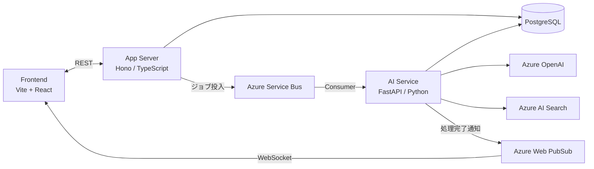

# Decision Loop

定例会議の密度を高めるAIエージェント。会議前準備・内容の構造化・曖昧点レビュー・タスク管理・次回会議への継続を一つのサイクルで支援します。

## Architecture



## Prerequisites

- Node.js 20+
- pnpm 9+
- Python 3.12+
- uv
- Docker / Docker Compose

### インストール（Mac）

```bash
# Homebrew（未インストールの場合）
/bin/bash -c "$(curl -fsSL https://raw.githubusercontent.com/Homebrew/install/HEAD/install.sh)"

# Node.js
brew install node

# pnpm
brew install pnpm

# Python 3.12
brew install python@3.12

# uv
brew install uv

# Docker Desktop
brew install --cask docker
```

## Getting Started

```bash
make install   # 依存関係のインストール（pnpm install + uv sync）
make dev       # 全サービス起動（Docker Compose + 開発サーバー）
```

## Development

```bash
make lint      # Biome (TS) + Ruff (Python)
make test      # Vitest + pytest
make migrate   # prisma migrate dev
```

## Contributing

- `main` への直接 push 禁止。必ず PR を経由する。
- コミット: [Conventional Commits](https://www.conventionalcommits.org/) 準拠（日本語）
- PR・Issue は `.github/` のテンプレートを使用
