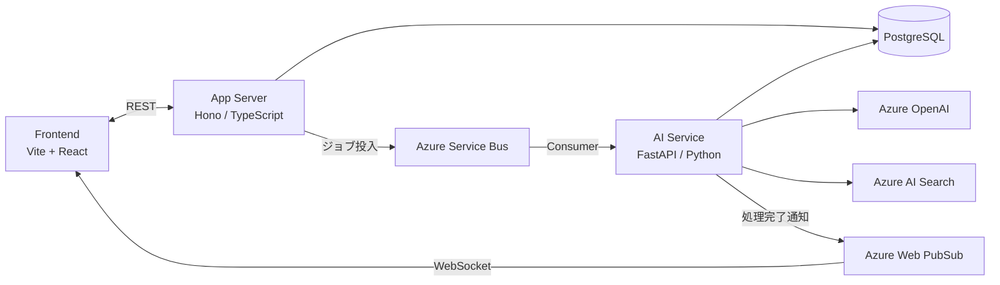

# Decision Loop

定例会議の密度を高めるAIエージェント。会議前準備・内容の構造化・曖昧点レビュー・タスク管理・次回会議への継続を一つのサイクルで支援します。

## Architecture



## Prerequisites

| ツール | バージョン | インストール |
|--------|-----------|------------|
| Node.js | 20+ | https://nodejs.org |
| pnpm | 9+ | `npm install -g pnpm` |
| Python | 3.12+ | https://www.python.org |
| uv | 最新 | `curl -LsSf https://astral.sh/uv/install.sh \| sh` |
| Docker / Docker Compose | 最新 | https://www.docker.com |
| overmind | 最新 | `brew install overmind` |

> **overmind** は複数プロセスを一括管理するツールです。`make dev` で Backend・Frontend・AI Service・WebSocket を同時起動するために使用します。

## Getting Started

```bash
make install   # 依存関係のインストール（pnpm install + uv sync）
make dev       # 全サービス起動（Docker + overmind）
```

### 起動されるサービス

| サービス | URL |
|---------|-----|
| Frontend (Vite + React) | http://localhost:5173 |
| Backend (Hono API) | http://localhost:3001 |
| AI Service (FastAPI + WebSocket) | http://localhost:8001 |
| AI Service docs | http://localhost:8001/docs |

## Development

```bash
make lint      # Biome (TS) + Ruff (Python)
make test      # Vitest + pytest
make migrate   # prisma migrate dev
```

## Contributing

- `main` への直接 push 禁止。必ず PR を経由する。
- コミット: [Conventional Commits](https://www.conventionalcommits.org/) 準拠（日本語）
- PR・Issue は `.github/` のテンプレートを使用
