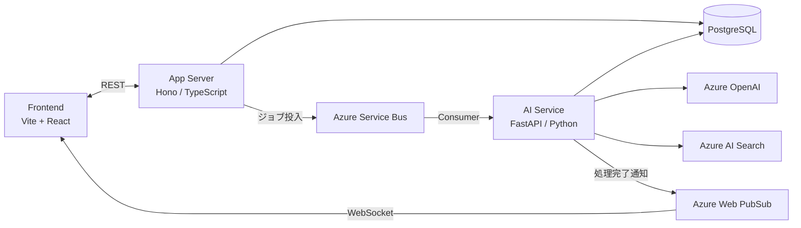

# Decision Loop

定例会議の密度を高めるAIエージェント。会議前準備・内容の構造化・曖昧点レビュー・タスク管理・次回会議への継続を一つのサイクルで支援します。

## Architecture



## Prerequisites

| ツール | バージョン | インストール |
|--------|-----------|------------|
| Node.js | 20+ | https://nodejs.org |
| pnpm | 9+ | `npm install -g pnpm` |
| Python | 3.12+ | https://www.python.org |
| uv | 最新 | `curl -LsSf https://astral.sh/uv/install.sh \| sh` |
| Docker / Docker Compose | 最新 | https://www.docker.com |
| overmind | 最新（`make dev-native` のみ） | `brew install overmind` |

## Getting Started

```bash
cp .env.example .env.local  # 環境変数を設定
make install                # 依存関係のインストール（pnpm install + uv sync）
make dev                    # 全サービスを Docker Compose で起動
make migrate                # DB マイグレーションを適用（初回起動時）
```

> アプリサービスをネイティブ起動したい場合は `docker-compose.yml` の web / api / ai をコメントアウトして `make dev-native` を使用してください（overmind が必要）。

### 起動されるサービス

| サービス | URL |
|---------|-----|
| Frontend (Vite + React) | http://localhost:5173 |
| Backend (Hono API) | http://localhost:3001 |
| AI Service (FastAPI + WebSocket) | http://localhost:8001 |
| AI Service docs | http://localhost:8001/docs |

### Docker 起動コマンドの使い分け

| コマンド | 用途 | DB データ |
|---------|------|---------|
| `make dev` | 通常起動（イメージ再ビルドなし） | 維持 |
| `make dev-build` | `package.json` / `Dockerfile` 変更後の再ビルド起動 | 維持 |
| `make dev-fresh` | `node_modules` が壊れたときのリセット起動 | **維持** |
| `make dev-reset` | DB 含む全 volume をリセットして起動 | **消える** |
| `make docker-clean` | コンテナと全 volume を削除（起動しない） | **消える** |

> `make dev-reset` / `make docker-clean` 後は `make migrate` で DB を再構築してください。

## Development

```bash
make lint             # Biome (TS) + Ruff (Python)
make test             # Vitest + pytest
make format           # Biome (TS) + Ruff (Python) の自動修正
make migrate          # prisma migrate dev（NAME=xxx でマイグレーション名を指定可）
make migrate-status   # マイグレーションの適用状況を確認
make db-shell         # psql で decision_loop DB に直接接続
```

## Contributing

- `main` への直接 push 禁止。必ず PR を経由する。
- コミット: [Conventional Commits](https://www.conventionalcommits.org/) 準拠（日本語）
- PR・Issue は `.github/` のテンプレートを使用
