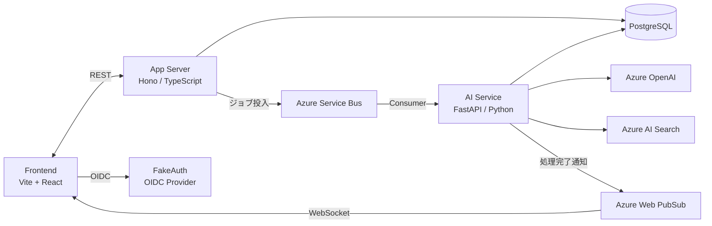

# Decision Loop

定例会議の密度を高めるAIエージェント。会議前準備・内容の構造化・曖昧点レビュー・タスク管理・次回会議への継続を一つのサイクルで支援します。

## Architecture


```mermaid
flowchart LR
    FE["Frontend\nVite + React"]
    API["App Server\nHono / TypeScript"]
    AI["AI Service\nFastAPI / Python"]
    AUTH["FakeAuth\nOIDC Provider"]
    DB[(PostgreSQL)]
    SB[Azure Service Bus]
    WP[Azure Web PubSub]
    OAI[Azure OpenAI]
    AIS[Azure AI Search]

    FE <-->|REST| API
    FE -->|OIDC| AUTH
    API --> DB
    API -->|ジョブ投入| SB
    SB -->|Consumer| AI
    AI --> OAI
    AI --> AIS
    AI --> DB
    AI -->|処理完了通知| WP
    WP -->|WebSocket| FE
```

## Prerequisites

| ツール | バージョン | インストール |
|--------|-----------|------------|
| Node.js | 20+ | https://nodejs.org |
| pnpm | 9+ | `npm install -g pnpm` |
| Python | 3.12+ | https://www.python.org |
| uv | 最新 | `curl -LsSf https://astral.sh/uv/install.sh \| sh` |
| Docker / Docker Compose | 最新 | https://www.docker.com |
| overmind | 最新（`make dev-native` のみ） | `brew install overmind` |

## Getting Started

```bash
cp .env.example .env.local  # 環境変数を設定
make install                # 依存関係のインストール（pnpm install + uv sync）
make fake-auth-keys         # fake-authのRSA鍵ペアを生成（初回のみ）
make dev                    # 全サービスを Docker Compose で起動
make migrate                # DB マイグレーションを適用（初回起動時）
```

> アプリサービスをネイティブ起動したい場合は `docker-compose.yml` の web / api / ai をコメントアウトして `make dev-native` を使用してください（overmind が必要）。

### OIDC 認証の動作確認

`make dev` 起動後、FakeAuth から取得した ID トークンが正しく検証されることと、api コンテナから fake-auth に Docker network 経由で到達できることを確認します。

```bash
# 1. FakeAuth から ID トークン取得（host から localhost:3007 経由）
TOKEN=$(curl -s -X POST http://localhost:3007/login \
  -H 'Content-Type: application/json' \
  -d '{"email":"admin@example.com"}' | jq -r .id_token)

# 2. fake-auth /me でトークン検証が通ることを確認（200 + ユーザー情報）
curl -i http://localhost:3007/me -H "Authorization: Bearer $TOKEN"

# 3. api コンテナから fake-auth の JWKS を取得できることを確認
docker compose exec api wget -qO- http://fake-auth:3007/.well-known/jwks.json
```

> 手順 3 が成功することで、api コンテナの OIDC ミドルウェア（`apps/api/src/middleware/auth.ts`）が token の `iss` クレーム（`http://fake-auth:3007`）と JWKS 取得経路の双方を満たせる構成になっていることを確認できます。
>
> 認証ミドルウェアを適用した API エンドポイントによる end-to-end 動作確認は、ミドルウェアを実ルートに適用する別 Issue で対応します（現時点では `apps/api/src/app.ts` のどのルートにも未適用）。

### `make dev-native` で OIDC を使う場合の追加設定

`make dev-native` は fake-auth のみを Docker で起動し、API は host で起動します。fake-auth の `ISSUER` は Docker network 用の `http://fake-auth:3007` に固定されているため、host 起動の API がトークン検証を通すには次の手順が必要です。

1. `/etc/hosts` に `fake-auth` を `127.0.0.1` のエイリアスとして追加する。

   ```bash
   echo '127.0.0.1 fake-auth' | sudo tee -a /etc/hosts
   ```

2. `apps/api/.env`（または `.env.local`）で `OIDC_ISSUER_URL` を fake-auth と同じ値に設定する。

   ```bash
   OIDC_ISSUER_URL="http://fake-auth:3007"
   ```

> どちらか片方だけだと「JWKS 取得失敗」または「iss 不一致」で 401 になります。

### 起動されるサービス

| サービス | URL |
|---------|-----|
| Frontend (Vite + React) | http://localhost:5173 |
| Backend (Hono API) | http://localhost:3001 |
| AI Service (FastAPI + WebSocket) | http://localhost:8001 |
| AI Service docs | http://localhost:8001/docs |
| **FakeAuth (OIDC Provider)** | http://localhost:3007 |

### Docker 起動コマンドの使い分け

| コマンド | 用途 | DB データ |
|---------|------|---------|
| `make dev` | 通常起動（イメージ再ビルドなし） | 維持 |
| `make dev-build` | `package.json` / `Dockerfile` 変更後の再ビルド起動 | 維持 |
| `make dev-fresh` | `node_modules` が壊れたときのリセット起動 | **維持** |
| `make refresh SVC=<service>` | 単一サービスを anon volume ごと再生成（pnpm 依存追加時など） | 維持 |
| `make dev-reset` | DB 含む全 volume をリセットして起動 | **消える** |
| `make docker-clean` | コンテナと全 volume を削除（起動しない） | **消える** |

> `make dev-reset` / `make docker-clean` 後は `make migrate` で DB を再構築してください。

### コンテナ運用補助

| コマンド | 用途 |
|---------|------|
| `make ps` | `docker compose ps` でコンテナ状態を確認する |
| `make logs` | 全サービスのログを follow する |
| `make logs SVC=<service>` | 個別サービスのログを follow する |
| `make help` | 利用可能な make ターゲット一覧を表示する |

## Development

```bash
make lint             # Biome (TS) + Ruff (Python)
make test             # Vitest + pytest
make format           # Biome (TS) + Ruff (Python) の自動修正
make migrate          # prisma migrate dev（NAME=xxx でマイグレーション名を指定可）
make migrate-status   # マイグレーションの適用状況を確認
make db-shell         # psql で decision_loop DB に直接接続
```

## Contributing

- `main` への直接 push 禁止。必ず PR を経由する。
- コミット: [Conventional Commits](https://www.conventionalcommits.org/) 準拠（日本語）
- PR・Issue は `.github/` のテンプレートを使用
