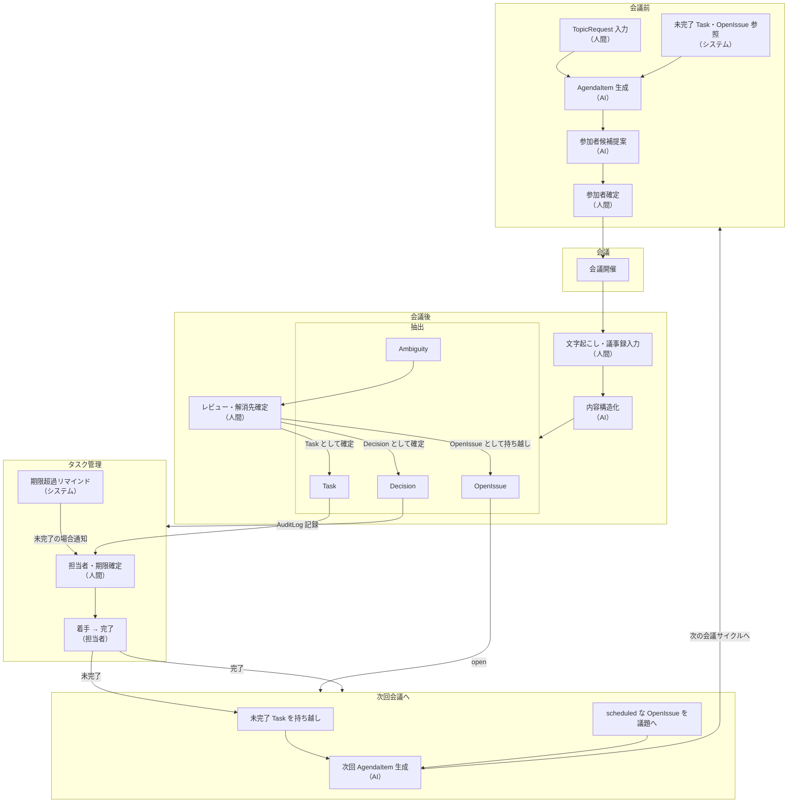

# ビジネスプロセスフロー図

```mermaid
flowchart TD
    subgraph PRE["会議前"]
        direction TB
        P1["TopicRequest 入力\n（人間）"]
        P2["未完了 Task・OpenIssue 参照\n（システム）"]
        P3["AgendaItem 生成\n（AI）"]
        P4["参加者候補提案\n（AI）"]
        P5["参加者確定\n（人間）"]

        P1 --> P3
        P2 --> P3
        P3 --> P4
        P4 --> P5
    end

    subgraph MTG["会議"]
        direction TB
        M1["会議開催"]
    end

    subgraph POST["会議後"]
        direction TB
        Q1["文字起こし・議事録入力\n（人間）"]
        Q2["内容構造化\n（AI）"]

        subgraph EXTRACT["抽出"]
            direction LR
            Q3["Decision"]
            Q4["OpenIssue"]
            Q5["Task"]
            Q6["Ambiguity"]
        end

        Q7["レビュー・解消先確定\n（人間）"]

        Q1 --> Q2
        Q2 --> EXTRACT
        Q6 --> Q7
        Q7 -->|"Decision として確定"| Q3
        Q7 -->|"OpenIssue として持ち越し"| Q4
        Q7 -->|"Task として確定"| Q5
    end

    subgraph TASK["タスク管理"]
        direction TB
        T1["担当者・期限確定\n（人間）"]
        T2["着手 → 完了\n（担当者）"]
        T3["期限超過リマインド\n（システム）"]

        T1 --> T2
        T3 -->|"未完了の場合通知"| T1
    end

    subgraph NEXT["次回会議へ"]
        direction TB
        N1["未完了 Task を持ち越し"]
        N2["scheduled な OpenIssue を議題へ"]
        N3["次回 AgendaItem 生成\n（AI）"]

        N1 --> N3
        N2 --> N3
    end

    P5 --> M1
    M1 --> Q1
    Q3 -->|"AuditLog 記録"| TASK
    Q5 --> T1
    Q4 -->|"open"| NEXT
    T2 -->|"未完了"| N1
    T2 -->|"完了"| NEXT
    N3 -->|"次の会議サイクルへ"| PRE
```
