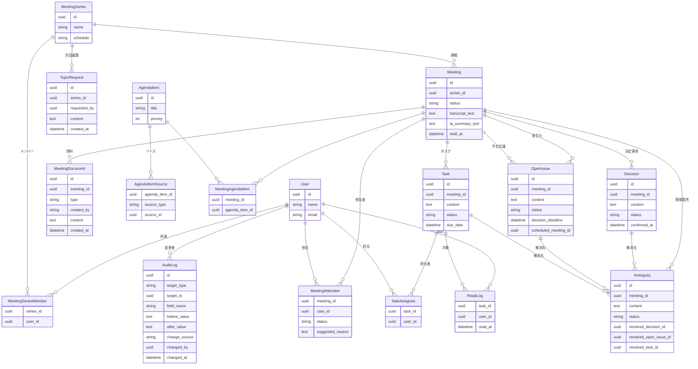

# DB設計 ER図

```mermaid
erDiagram
    User {
        uuid id
        string name
        string email
    }
    MeetingSeries {
        uuid id
        string name
        string schedule
    }
    MeetingSeriesMember {
        uuid series_id
        uuid user_id
    }
    Meeting {
        uuid id
        uuid series_id
        string status
        text transcript_text
        text ai_summary_text
        datetime held_at
    }
    MeetingAttendee {
        uuid meeting_id
        uuid user_id
        string status
        text suggested_reason
    }
    MeetingDocument {
        uuid id
        uuid meeting_id
        string type
        string created_by
        text content
        datetime created_at
    }
    TopicRequest {
        uuid id
        uuid series_id
        uuid requested_by
        text content
        datetime created_at
    }
    AgendaItem {
        uuid id
        string title
        int priority
    }
    AgendaItemSource {
        uuid agenda_item_id
        string source_type
        uuid source_id
    }
    MeetingAgendaItem {
        uuid meeting_id
        uuid agenda_item_id
    }
    Decision {
        uuid id
        uuid meeting_id
        text content
        string status
        datetime confirmed_at
    }
    OpenIssue {
        uuid id
        uuid meeting_id
        text content
        string status
        datetime decision_deadline
        uuid scheduled_meeting_id
    }
    Task {
        uuid id
        uuid meeting_id
        text content
        string status
        datetime due_date
    }
    TaskAssignee {
        uuid task_id
        uuid user_id
    }
    Ambiguity {
        uuid id
        uuid meeting_id
        text content
        string status
        uuid resolved_decision_id
        uuid resolved_open_issue_id
        uuid resolved_task_id
    }
    AuditLog {
        uuid id
        string target_type
        uuid target_id
        string field_name
        text before_value
        text after_value
        string change_source
        uuid changed_by
        datetime changed_at
    }
    ReadLog {
        uuid task_id
        uuid user_id
        datetime read_at
    }

    User ||--o{ MeetingSeriesMember : "所属"
    MeetingSeries ||--o{ MeetingSeriesMember : "メンバー"
    MeetingSeries ||--o{ Meeting : "開催"
    MeetingSeries ||--o{ TopicRequest : "次回議題"
    Meeting ||--o{ MeetingAttendee : "参加者"
    User ||--o{ MeetingAttendee : "参加"
    Meeting ||--o{ MeetingDocument : "資料"
    Meeting ||--o{ MeetingAgendaItem : ""
    AgendaItem ||--o{ MeetingAgendaItem : ""
    AgendaItem ||--o{ AgendaItemSource : "ソース"
    Meeting ||--o{ Decision : "決定事項"
    Meeting ||--o{ OpenIssue : "発生元"
    Meeting ||--o{ Task : "タスク"
    Meeting ||--o{ Ambiguity : "曖昧箇所"
    Task ||--o{ TaskAssignee : "担当者"
    User ||--o{ TaskAssignee : "担当"
    Decision ||--o{ Ambiguity : "解消先"
    OpenIssue ||--o{ Ambiguity : "解消先"
    Task ||--o{ Ambiguity : "解消先"
    Meeting ||--o{ OpenIssue : "予定会議"
    User ||--o{ AuditLog : "変更者"
    User ||--o{ ReadLog : "既読"
    Task ||--o{ ReadLog : "対象"
```
