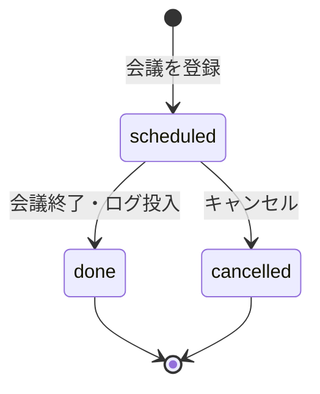
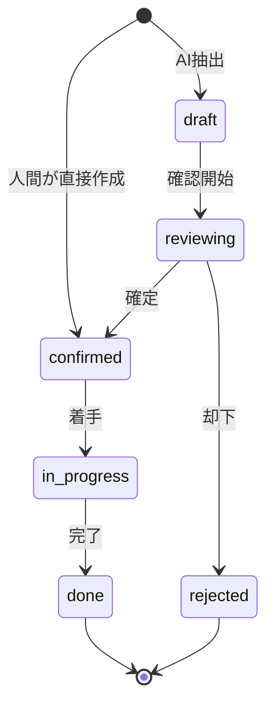
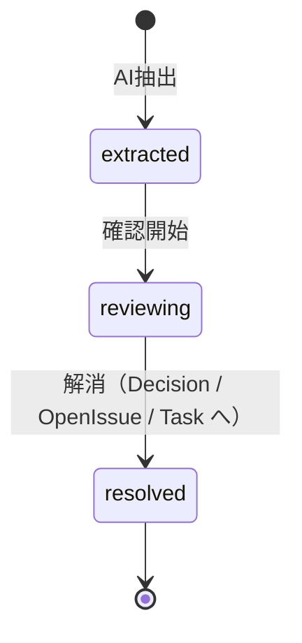
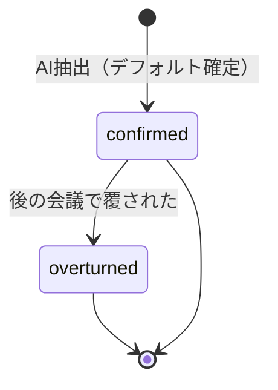
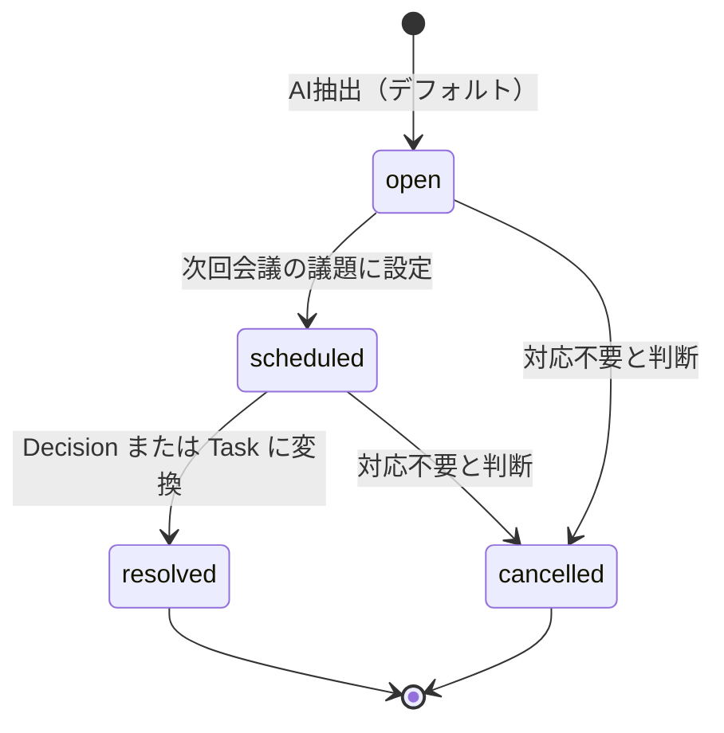

# 状態遷移図

## Meeting

```mermaid
stateDiagram-v2
    [*] --> scheduled : 会議を登録
    scheduled --> done : 会議終了・ログ投入
    scheduled --> cancelled : キャンセル
    done --> [*]
    cancelled --> [*]
```

---

## Task

```mermaid
stateDiagram-v2
    [*] --> draft : AI抽出
    [*] --> confirmed : 人間が直接作成
    draft --> reviewing : 確認開始
    reviewing --> confirmed : 確定
    reviewing --> rejected : 却下
    confirmed --> in_progress : 着手
    in_progress --> done : 完了
    done --> [*]
    rejected --> [*]
```

---

## Ambiguity

```mermaid
stateDiagram-v2
    [*] --> extracted : AI抽出
    extracted --> reviewing : 確認開始
    reviewing --> resolved : 解消（Decision / OpenIssue / Task へ）
    resolved --> [*]
```

---

## Decision

```mermaid
stateDiagram-v2
    [*] --> confirmed : AI抽出（デフォルト確定）
    confirmed --> overturned : 後の会議で覆された
    overturned --> [*]
    confirmed --> [*]
```

---

## OpenIssue

```mermaid
stateDiagram-v2
    [*] --> open : AI抽出（デフォルト）
    open --> scheduled : 次回会議の議題に設定
    open --> cancelled : 対応不要と判断
    scheduled --> resolved : Decision または Task に変換
    scheduled --> cancelled : 対応不要と判断
    resolved --> [*]
    cancelled --> [*]
```
